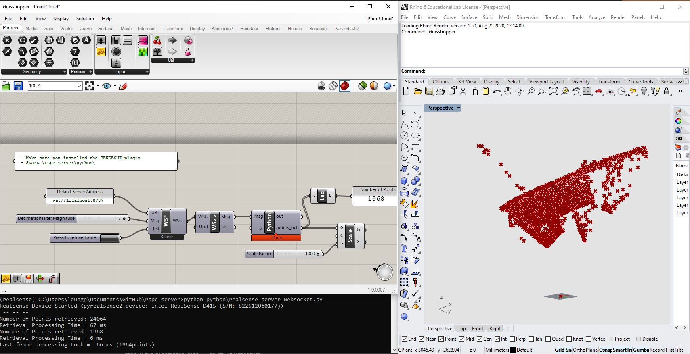

# realsense_pointcloud_server
*Intel RealSense Pointcloud Server*

This is a lightweight python script that process Realsense depth frame in real time. It converts the frame into a point cloud that can be retrieved on-demand via a websocket interface. The intended use of this script is for occasional point cloud retrieval with minimal latency, although high frequency use is possible.

**Websocket Interface** allows any applications such as Rhino Python, Python within Grasshopper or any other scripts to retrieve the point cloud. The point cloud is encoded in json format as a list of [x,y,z] values.

**Buffering and retrieval** The script polls the sensor for a frame at 15fps (alternatively 30 / 60fps). The script process and keep the latest frame in buffer for low-latency on-demand retrieval via websocket. 

**Filtering** Realsense SDK built-in Temporal Filter is a applied for smoother result. Decimation Filter (reduce points) is applied with configurable magnitude (default = 2) to reduce the amount of points retrieved. This can improve computational performance for some downstream operations. Refer to [this post-processing-filter guide](https://github.com/IntelRealSense/librealsense/blob/master/doc/post-processing-filters.md) by Intel.

**Advanced Settings** If you use the Intel RealSense Viewer, you can change the device settings and get different results (such as higher accuracy in the expanse of more dropped points). These settings can be saved to a json file via the user interface in the Intel RealSense Viewer. This can be loaded by the script. Default is "HighAccuracy". Refer to [this preset guide](https://github.com/IntelRealSense/librealsense/wiki/D400-Series-Visual-Presets) by Intel where you can also download other premade json.

**Origin and Scale** The retrieved point cloud is located in a Cartesian coordinate frame where the origin is located at the left camera of the sensor. The scale is meters by device default. Refer to [this guide](https://github.com/IntelRealSense/librealsense/wiki/Projection-in-RealSense-SDK-2.0?language=en_US#point-coordinates) by Intel.

### Installation

- Install Intel [Realsense SDK](https://www.intelrealsense.com/sdk-2/) (you only need the SDK2.0, the RealSenseViwer is not necessary)

- Install [pyrealsense2](https://pypi.org/project/pyrealsense2/) python library

````
pip install pyrealsense2
````

- Install [websockets](https://pypi.org/project/websockets/) python library

```
pip install websockets
```

- Install [NumPy](https://numpy.org/install/) python library

```
pip install numpy
```

### Server Start

- open a console

- change directory to \rspc_server

- run \python\realsense_server_websocket.py

```
(realsense) C:\Users\leungp\Documents\GitHub\rspc_server>python python\realsense_server_websocket.py
```

- Close the console to end the server

### **Client Side Example (Grasshopper)**

Grasshopper can connect to Websocket via the [BENGESHT plugin](https://www.food4rhino.com/app/bengesht)

See Example file ([/grasshopper/PointCloud.gh](grasshopper/PointCloud.gh))



The computation time is directly related to the number of points retrieved, this is dependent on the scene and changes from frame to frame. The main bottle neck is in this particular use case is the function to create Rhino Point3D objects in Grasshopper. The number of retrieved points can be reduced by the decimation filter to improve latency.

#### Tested with 

- Intel RealSense D415 with firmware 05.12.07.100
- Python 3.7 
- RealSense SDK 2.38.1
- Bengesht 3.3
- pyrealsense2 2.38.1.2225
- websockets 8.1

#### Credit

This script is inspired by [ilmihur/depthscanner](https://github.com/ilmihur/depthscanner) and examples from [librealsense](https://github.com/IntelRealSense/librealsense/tree/master/wrappers/python/examples)

Created by Pok Yin Victor Leung 